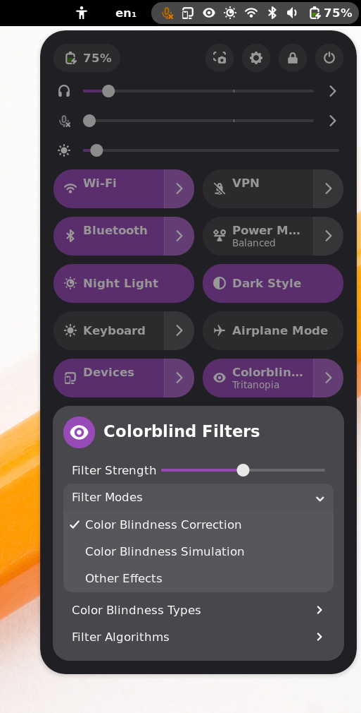

# Colorblind Filters Advanced
A GNOME Shell extension that adds a Quick Settings menu for full-screen color
filters that should help colorblind users and developers.

This extension was forked from [the original on
GitHub](https://github.com/G-dH/gnome-colorblind-filters). It has different
filter options and a different user interface.

Originally, this extension use the algorithms used by Android devices to
simulate and correct color blindness, but I've continued to experiment with
changes to the algorithm and entirely new filters. I'm happy with the gradual
improvements I've made, but I've also kept the older, worse filters in the
extension to prove to myself that my changes have been an improvement.

## Screenshot

## Installation from Source

Should support GNOME Shell 45 - 48, but I don't test against older versions.

To install, fetch the source and run `make install`:

    git clone https://codeberg.org/amyp/gnome-colorblind-filters.git
    cd gnome-colorblind-filters
    make install

Then, either reload GNOME Shell (X11 only; press Alt+F2 and enter "r") or log
out and back in (X11 and Wayland) to load the extension.

## Quick Start

Once installed, a new button will appear in the Quick Settings menu. Clicking
it toggles the currently-selected filter, and opening it reveals configuration
options.

For correcting color blindness, the defaults should be pretty reasonable, just
pick your color blindness type from the menu and turn the filter on and adjust
the strength slider until things look okay. If nothing looks good, or if you
just like to tinker, try changing the algorithm (see below).

## Other Setup Instructions

### Filtering Fullscreen Applications

These filters are used by GNOME's compositor, but it typically doesn't run for
fullscreen applications (games, movies, etc.) for performance reasons. To make
these filters work in fullscreen windows, you need one of the following
extensions:

- https://extensions.gnome.org/extension/1873/disable-unredirect-fullscreen-windows/
  (at time of writing, this extension doesn't support GNOME 48)
- https://extensions.gnome.org/extension/8008/disable-unredirect/ (at time of
  writing, only GNOME 48 is supported)

### Configuring Hotkeys

This extension doesn't directly support adding hotkeys, but it's still possible
to set them up.

This extension responds immediately to dconf settings changes. Its settings can
be found in `/org/gnome/shell/extensions/colorblind-filters-advanced`. You can
set a custom shortcut in GNOME's keyboard settings to run `dconf` to modify
those settings. For example, I have Super+F7 and Super+F8 set to turn the
filter off and on by running

    dconf write /org/gnome/shell/extensions/colorblind-filters-advanced/filter-active false

and

    dconf write /org/gnome/shell/extensions/colorblind-filters-advanced/filter-active true

## Filter Algorithm Descriptions

This extension includes many simulation and correction algorithms. They range
in quality and complexity, and of course, each user will have their own
preference for which algorithm works "best".

As general guidelines:

- "Opponent Color Solver" is preferred by the developer for correcting their
  moderate tritanomaly. This algorithm is being developed in this extension, so
  if it doesn't work well for you, please open an issue so it can be improved!
- "Error Steering" (only for correction) works well for fixing visibility
  problems for tritanomaly, but hasn't been tuned or validated for other color
  blindness types. Check out [this
  issue](https://github.com/deldotbrain/gnome-colorblind-filters/issues/2) if
  you'd like to help fix that!
- "GdH's Filters" are the filters that the original extension provides. Many
  people like them.
- "Daltonize" is more or less the same algorithm used by most other
  simulation/correction filters.
- "Android" is the slightly funky version of "Daltonize" used by Android. [The
  developer thinks that's a bug in Android, and originally started this project
  to prove
  it.](https://github.com/deldotbrain/gnome-colorblind-filters/issues/1).

### "GdH's Filters"

These are the daltonization filters used by the original Colorblind Filters
extension. They use a lot of magic numbers whose provenance isn't clear to me,
so I can't comment on how they really work, except to say that they're
superficially similar to other daltonization algorithms. GdH says he focused on
color differentiability when designing them.

These filters also have an option for "high contrast" mode for protanopia and
deuteranopia, similar to the original extension.

### "Android"

These are the daltonization filters used in Android. They use a poorly-selected
transform into LMS color space that causes them to look worse than other
filters. Otherwise, they are similar to other
[daltonization](http://www.daltonize.org/2010/05/lms-daltonization-algorithm.html)
filters.

These filters work by finding a plane in [LMS
space](https://en.wikipedia.org/wiki/LMS_color_space) that includes both the
black-to-white and black-to-(some unaffected color) vectors, then projecting
the LMS value of a color down onto it to simulate the loss of sensitivity to
the affected color. If correcting for color blindness, the stimulus that was
lost in the process is spread over the unaffected cones.

### "Daltonize"

The same filters as "Android", but with a better choice of color space transform
that (in the developer's opinion) makes them look better. Most other
daltonization filters work very similarly.

### "Error Steering"

To the best of my knowledge, these filters use a novel change to the typical
daltonization filter that makes them more useful for correction. Instead of
spreading the lost stimulus to the other cones, a specific color is added to
the image in proportion to the amount of error that color blindness would
cause.

For example, I (tritanomalous) find that adding white to replace the blue light
that I didn't see is very helpful for making blue more visible in the ways it's
commonly used in computer UIs. Conversely, this filter also subtracts white
from yellow, making it easier for me to distinguish from white.

### Side-note: "Modified" Transform for Tritanopia

When dealing with tritanopia, daltonization filters typically ignore the fact
that both red and green are unaffected by tritanopia and are perceived more or
less independently from blue. Typically, they arbitrarily choose to hold red
constant when simulating, changing the appearance of greens considerably.

The "Modified" transform holds the difference between red and green constant,
balancing the change in their appearance between them. To my eyes, this looks
less weird, but I don't have any evidence to say that it's more accurate.

### "Opponent Color Solver" Filters

These filters are radically different from anything else in this extension, and
from any other filter I've seen in the wild. Whether that's a good thing or not
remains to be seen.

These filters operate in
[opponent-color](https://foundationsofvision.stanford.edu/chapter-9-color/#Opponent-Colors)
space and are built on the work of [Machado et
al.](https://www.inf.ufrgs.br/~oliveira/pubs_files/CVD_Simulation/CVD_Simulation.html)
to simulate color blindness. While their proposed simulation isn't considered
to be as accurate as others, its use of opponent color makes a very different
correction approach possible.

The correction filters search RGB space for a color which the colorblind
observer is expected to perceive as the original color was intended. To do
this, they define a cost function to describe the "badness" of a chosen color
based on its distance from the intended color in simulated opponent-color space
and from the original color in RGB space. They search near the original color
using a couple iterations of gradient descent to find an RGB value with minimal
cost and display it.

This approach is necessarily much more expensive than other filters (probably
by a factor of 20-30, though it still doesn't add up to much actual
utilization), but yields results that (at least to my tritanomalous eyes) look
more natural. While there are probably some optimizations that could be made to
the filter algorithm, this filter will always be more complex to execute than
daltonization, and daltonization (and linear filters more generally)
fundamentally cannot make the same modifications that this filter does. Is it
worth it? You decide.

The simulation filters apply a trivial linear transformation (inverse of ideal
RGB-to-opponent transform multiplied by simulated RGB-to-opponent transform).
They don't do any fancy cost function optimization on the assumption that color
blindness only ever reduces the gamut, so the result of a linear transformation
will always be within the RGB gamut. These filters aren't (currently) terribly
accurate, but they provide valuable insight into how the OCS filters understand
color blindness and what they're actually trying to correct for. Note that
although much of the approach used by these filters is similar to the work of
Machado et al., they are **not** the same simulation and shouldn't be taken as
a representation of their work!

These filters are still very much under development. I think the correction
filters already look better than other filters, but there are still many
improvements I'd like to make. Among other things, I'd like to significantly
increase their maximum strength, fix the green tint and decrease of red and
green brightness that the tritanomaly filter causes, etc. If you've actually
tried them, I want to know how they work for you! Open an issue to discuss,
send me an email (the address on my commits works), or whatever.

## Contribution
Unless your contribution is specific to the filter algorithms, please consider
making your contribution to the original extension [on
GitHub](https://github.com/G-dH/gnome-colorblind-filters) so that its users can
benefit from it. Of course, I'll accept contributions here, as well.

Also, feel free to [buy the author of the original extension a
coffee](https://buymeacoffee.com/georgdh) if you find this extension useful.
His extension inspired me to start thinking about filters like these and gave
me a great starting point to experiment.
