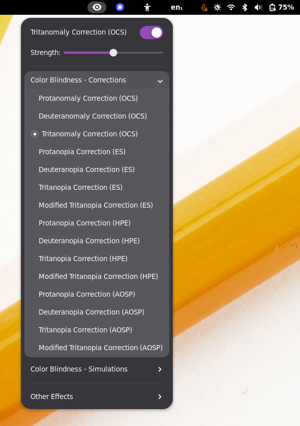

# Colorblind Filters
A GNOME Shell extension for main panel that offers full-screen color filters
that should help color blind users and developers.

This version was forked from [the original on
GitHub](https://github.com/G-dH/gnome-colorblind-filters) to replace its
daltonization algorithm with the one used by Android devices, which I find more
helpful. Since then, I've also used it to experiment with a number of changes
to the algorithm and with new algorithms, and I'm very happy with the results.
I've kept older, worse filters in the extension to prove to myself that my
changes have been an improvement.

## Screenshot

Yes, there are too many filters. No, I won't remove any.

## Installation

    git clone https://codeberg.org/amyp/gnome-colorblind-filters.git
    cd gnome-colorblind-filters
    make install

Supports GNOME Shell 45 - 48, but I don't test against older versions.

## "Quick" Start

At this point, this extension has entirely too many filter options to choose
from (28 at the time of writing!), and choosing is probably overwhelming. If
you want to correct for color blindness:

1. For mild to moderate prot/deuter/tritanomaly, try the "OCS" filters first.
   They should preserve the most color information and cause the least
   unnecessary distortion. If they don't work well for you, please open an
   issue! They're my babies and I love them very much.
2. For tritanomaly, if the "OCS" filter doesn't agree with you, try the
   "Modified Tritanopia Correction (ES)" filter. I prefer the "Modified"
   version, but YMMV. (The "ES" filters for other color blindness types haven't
   been tuned or validated, so I can't recommend them. Check out [this
   issue](https://github.com/deldotbrain/gnome-colorblind-filters/issues/2) if
   you'd like to help fix that!)
3. Use the "HPE" filter for your color blindness type.
4. Don't use the "AOSP" filters. They're included only to demonstrate that
   there's a bug in Android that makes its filters look worse.

If you want to simulate color blindness, use the "HPE" filters. Again, the
"AOSP" filters only exist to demonstrate an Android bug. I suspect that the
"Modified Tritanopia Correction (HPE)" filter is more accurate than its
un-"Modified" version, but I have no real evidence for that claim.

## Filter Descriptions

Filters are grouped into major categories (color blindness corrections,
color blindness simulations, other effects). Within the color blindness
categories, filters have a "(FOO)" at the end of their name, indicating the
general approach used by the filter.

In order of increasing goodness, those approaches are:

### "AOSP" Filters

These are the daltonization filters used in Android. They use a poorly-selected
transform into LMS color space that causes them to look worse than other
filters. Otherwise, they are similar to other
[daltonization](http://www.daltonize.org/2010/05/lms-daltonization-algorithm.html)
filters.

These filters work by finding a plane in [LMS
space](https://en.wikipedia.org/wiki/LMS_color_space) that includes both the
black-to-white and black-to-(some unaffected color) vectors, then projecting
the LMS value of a color down onto it to simulate the loss of sensitivity to
the affected color. If correcting for color blindness, the stimulus that was
lost in the process is spread over the unaffected cones.

Named after the Android Open Source Project.

### "HPE" Filters

The same filters as "AOSP", but with a better choice of color space transform
that makes them look better. Most other daltonization filters work very
similarly.

Named after the [Hunt–Pointer–Estevez XYZ-to-LMS
transform](https://en.wikipedia.org/wiki/LMS_color_space#Hunt,_RLAB) that it
uses.

### "ES" Filters

To the best of my knowledge, these filters use a novel change to the typical
daltonization filter that makes them more useful for correction. Instead of
spreading the lost stimulus to the other cones, the error vector is rotated in
a chosen direction and added back into the image in an effort to improve
visibility of the missing color.

For example, I (tritanomalous) find that adding white to replace the blue light
that I didn't see is very helpful for making blue more visible in the ways it's
commonly used in computer UIs. Conversely, this filter also subtracts white
from yellow, making it easier for me to distinguish from white.

Named for their Error Steering approach.

### Side-note: "Modified" Tritanopia Filters

When dealing with tritanopia, daltonization filters typically ignore the fact
that both red and green are unaffected by tritanopia and are perceived more or
less independently from blue. Typically, they arbitrarily choose to hold red
constant when simulating, changing the appearance of greens considerably.

The "Modified" filters hold the difference between red and green constant,
balancing the change in their appearance between them. To my eyes, this looks
less weird, but I don't have any evidence to say that it's more accurate.

### "OCS" Filters

These filters are radically different from anything else in this extension, and
from any other filter I've seen in the wild. Whether that's a good thing or not
remains to be seen.

These filters operate in
[opponent-color](https://foundationsofvision.stanford.edu/chapter-9-color/#Opponent-Colors)
space and are built on the work of [Machado et
al.](https://www.inf.ufrgs.br/~oliveira/pubs_files/CVD_Simulation/CVD_Simulation.html)
to simulate color blindness. While their proposed simulation isn't considered
to be as accurate as others, its use of opponent color makes a very different
correction approach possible.

These filters search RGB space for a color which the colorblind observer is
expected to perceive as the original color was intended. To do this, they define
a cost function to describe the "goodness" of a chosen color based on its
closeness to the intended color in opponent-color space and to the original
color in RGB space. It searches near the original color using a couple
iterations of gradient descent to find an RGB value with minimal cost and
displays it.

This approach is necessarily much more expensive than other filters (probably
by a factor of 20-30, though it still doesn't add up to much actual
utilization), but yields results that (at least to my tritanomalous eyes) look
more natural. While there are probably some optimizations that could be made to
the filter algorithm, this filter will always be more complex to execute than
daltonization, and daltonization (and linear filters more generally)
fundamentally cannot make the same modifications that this filter does. It is
worth it? You decide.

These filters are still very much under development. I think they already look
better than other filters, but there are still many improvements I'd like to
make. Among other things, I'd like to significantly increase their maximum
strength, fix the green tint and decrease of red and blue brightness that the
tritanomaly filter causes, etc. If you've actually tried them, I want to know
how they work for you! Open an issue to discuss, send me an email (the address
on my commits works), or whatever.

Named for being Opponent Color Solvers.

## Contribution
Unless your contribution is specific to the filter algorithms, please consider
making your contribution to the original extension [on
GitHub](https://github.com/G-dH/gnome-colorblind-filters) so that its users can
benefit from it. Of course, I'll accept contributions here, as well.

Also, feel free to [buy the author of the original extension a
coffee](https://buymeacoffee.com/georgdh) if you find this extension useful.
His extension inspired me to start thinking about filters like these and gave
me a great starting point to experiment.
