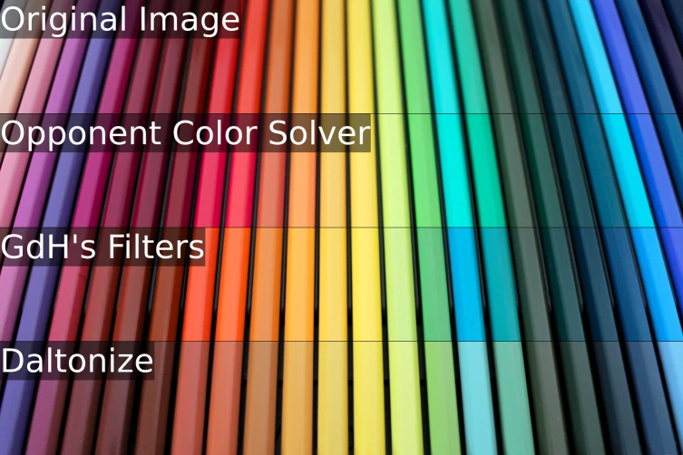
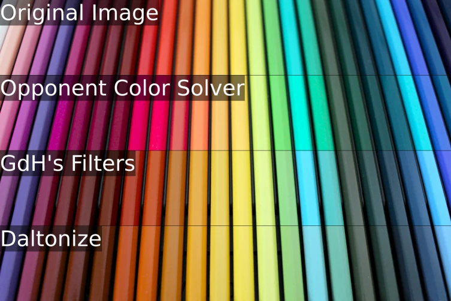
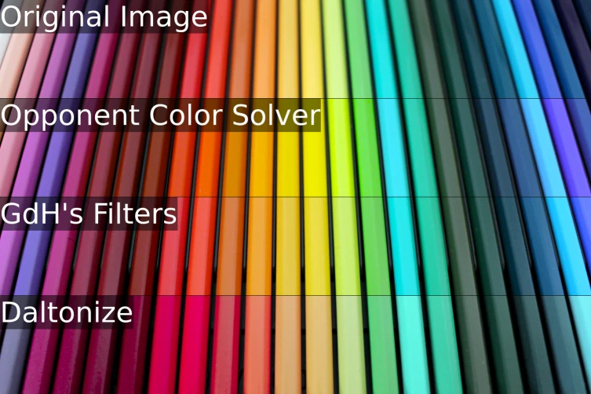

# Colorblind Filters Advanced
A GNOME Shell extension that adds a Quick Settings menu for full-screen color
filters that should help colorblind users and developers.

The primary purpose of this extension is to help colorblind users see more
accurately and use their computers more easily. Many filters are provided to
correct color blindness, and the developer believes that their "Opponent Color
Solver" filter is a significant improvement over the state of the art. Other
filters are also provided, such as those from GdH's Colorblind Filters
extension and from Android phones.

Filters to simulate color blindness are provided to help developers understand
how colorblind users see. However, these aren't the focus of this extension, so
options are limited. The most accurate simulation algorithms don't have a
corresponding correction algorithm, so they haven't been added to the extension
yet. If there's a need for those filters, they could be added upon request.

A few effects from the original extension that aren't related to color
blindness are included as well.

This extension was forked from [the original on
GitHub](https://github.com/G-dH/gnome-colorblind-filters). It has more filter
options and a different user interface.

## Screenshots

### Quick Settings Menu

### Filter Algorithm Samples

In all images, the filter strength was set to 50%, except for the Daltonize
algorithm, where it was set to 35%. The original image was [created by
Pixabay](https://www.pexels.com/photo/assorted-color-pencil-set-459799/).

|Protanopia Correction|Deuteranopia Correction|Tritanopia Correction|
|---|---|---|
||||

## Installation

Should support GNOME Shell 45 - 48, but older versions are not tested.

### From GNOME Extensions

This extension has [a page on GNOME Shell
Extensions](https://extensions.gnome.org/extension/8382/colorblind-filters-advanced/)!
You can install it with the browser extension, or by downloading the extension
and running `gnome-extensions install colorblind-filters-advanced.zip` (or
whatever the zip file is named).

### On NixOS

Using flakes, add
`git+https://codeberg.org/amyp/gnome-colorblind-filters.git?ref=main` as a
flake input. Add its `packages.<system>.default` output to your
`environment.systemPackages` (NixOS) or `home.packages` (home-manager).

If you prefer not to use flakes, you can `callPackage` the `package.nix` file
directly. Make sure to explicitly pass a `version` or `srcRev` argument.

### From Source

To build from source, you'll need `git`, GNU `make` and `zip`. Depending on
your distro, you might also need a development package for `glib`. `gettext` is
optional, but without it, translations will not be available.

Once you have the dependencies installed, fetch the source and run `make
install`:

    git clone https://codeberg.org/amyp/gnome-colorblind-filters.git
    cd gnome-colorblind-filters
    make install

## Getting Started

### Configuring the Extension

Once installed, either reload GNOME Shell (only works on X11; press Alt+F2 and
enter "r") or log out and back in (works on both X11 and Wayland) to load the
extension. Enable it in the Extensions app.

Once enabled, a new button will appear in the Quick Settings menu. Clicking
it toggles the currently-selected filter, and opening it reveals configuration
options.

For correcting color blindness, the defaults should be pretty reasonable, just
pick your color blindness type from the menu, turn the filter on, and adjust
the strength slider until things look okay. If nothing looks good, or if you
just like to tinker, try changing the algorithm (see below).

### Filtering Fullscreen Applications

These filters are used by GNOME's compositor, but it typically doesn't run for
fullscreen applications (games, movies, etc.) for performance reasons. To make
these filters work in fullscreen windows, you need one of the following
extensions:

- https://extensions.gnome.org/extension/1873/disable-unredirect-fullscreen-windows/
  (at time of writing, this extension doesn't support GNOME 48)
- https://extensions.gnome.org/extension/8008/disable-unredirect/ (at time of
  writing, only GNOME 48 is supported)

### Configuring Hotkeys

This extension doesn't directly support adding hotkeys, but it's still possible
to set them up.

This extension responds immediately to dconf settings changes. Its settings can
be found in `/org/gnome/shell/extensions/colorblind-filters-advanced`. You can
set a custom shortcut in GNOME's keyboard settings to run `dconf` to modify
those settings. For example, the commands to turn the filters off and on are:

    dconf write /org/gnome/shell/extensions/colorblind-filters-advanced/filter-active false

and

    dconf write /org/gnome/shell/extensions/colorblind-filters-advanced/filter-active true

## Selecting a Filter Algorithm

This extension includes many simulation and correction algorithms. They range
in quality and complexity, and of course, each user will have their own
preference for which algorithm works "best".

As general guidelines:

- "Opponent Color Solver" is the default and is thought by the developer to be
  more effective and natural-looking than other algorithms. This algorithm is
  being developed as part of this extension, so any feedback you can provide is
  helpful!
- "Error Steering" (only for correction) works well for aggressively fixing
  visibility problems, including for severe color blindness. However, it hasn't
  been tuned for color blindness types other than tritanomaly. Check out [this
  issue](https://github.com/deldotbrain/gnome-colorblind-filters/issues/2) if
  you'd like to help tune it.
- "GdH's Filters" are the filters that the original Colorblind Filters
  extension provides. Many people like them.
- "Daltonize" is more or less the same algorithm used by most other
  simulation/correction filters.
- "Android" is the slightly funky version of "Daltonize" used by Android.

More detailed descriptions of the filters can be found [in this
document](misc/filters.md).

## Contribution
Consider contributing to the [original
extension](https://github.com/G-dH/gnome-colorblind-filters) instead of this
fork. The original has many more users, so your contribution can help more
people. Of course, if you'd prefer to work on this extension, your
contributions are welcome! Please open issues and PRs [on
Codeberg](https://codeberg.org/amyp/gnome-colorblind-filters). Issues and PRs
[on GitHub](https://github.com/deldotbrain/gnome-colorblind-filters) are also
accepted.

## Donations
The developer doesn't need or want donations for their work. If you find it
valuable, please consider donating to an organization that provides direct
support to their queer siblings. For example, [Pride Center of
Vermont](https://www.pridecentervt.org/), [Trevor
Project](https://www.thetrevorproject.org/), and [Rainbow
Railroad](https://www.rainbowrailroad.org/) always need support. Alternatively,
feel free to [buy the author of the original extension a
coffee](https://buymeacoffee.com/georgdh). His extension inspired the developer
to start thinking about filters like these and provided a great starting point
to experiment.

## License
This code is distributed under the terms of the GNU General Public License
version 3.0. The files related to the Opponent Color Solver filters may also be
used under the terms of the Zero-Clause BSD License.
